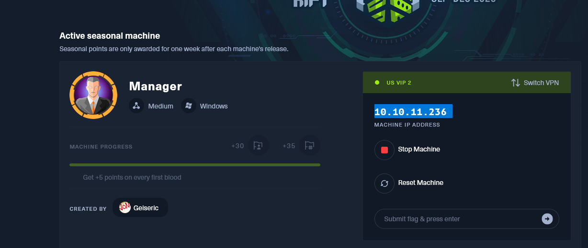
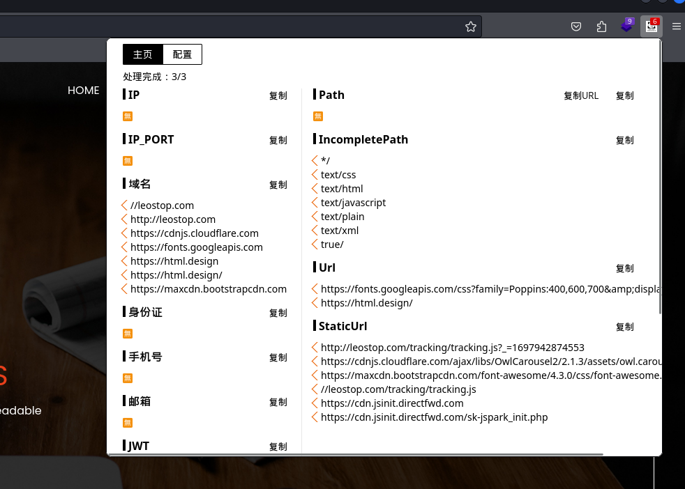
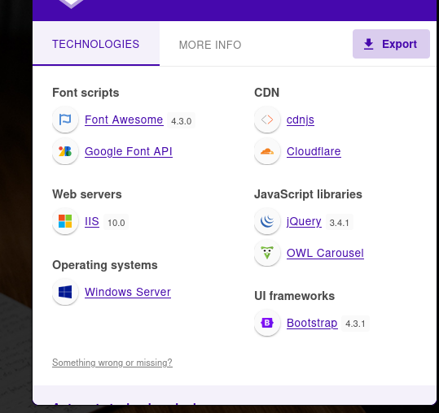
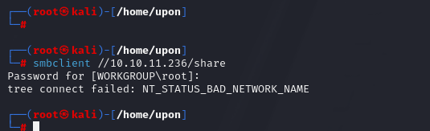

* 10.10.11.236 

  






```
map scan report for 10.10.11.236                                                                                                                                                                                                    [11/32]
Host is up (0.42s latency).                                                                                                                                                                                                                 
Not shown: 987 filtered tcp ports (no-response)                                                                                                                                                                                             
PORT     STATE SERVICE                                                                                                                                                                                                                      
53/tcp   open  domain                                                                                                                                                                                                                       
80/tcp   open  http                                                                                                                                                                                                                         
| http-methods:                                                                                                                                                                                                                             
|_  Potentially risky methods: TRACE                                                                                                                                                                                                        
|_http-title: Manager                                                                                                                                                                                                                       
88/tcp   open  kerberos-sec                                                                                                                                                                                                                 
135/tcp  open  msrpc                                                                                                                                                                                                                        
139/tcp  open  netbios-ssn                                                                                                                                                                                                                  
389/tcp  open  ldap
| ssl-cert: Subject: commonName=dc01.manager.htb
| Subject Alternative Name: othername: 1.3.6.1.4.1.311.25.1::<unsupported>, DNS:dc01.manager.htb
| Not valid before: 2023-07-30T13:51:28
|_Not valid after:  2024-07-29T13:51:28
|_ssl-date: 2023-10-22T09:48:20+00:00; +6h59m57s from scanner time.
445/tcp  open  microsoft-ds
464/tcp  open  kpasswd5
593/tcp  open  http-rpc-epmap
636/tcp  open  ldapssl
|_ssl-date: 2023-10-22T09:48:04+00:00; +6h59m57s from scanner time.
| ssl-cert: Subject: commonName=dc01.manager.htb
| Subject Alternative Name: othername: 1.3.6.1.4.1.311.25.1::<unsupported>, DNS:dc01.manager.htb
| Not valid before: 2023-07-30T13:51:28
|_Not valid after:  2024-07-29T13:51:28
1433/tcp open  ms-sql-s
| ssl-cert: Subject: commonName=SSL_Self_Signed_Fallback
| Not valid before: 2023-10-22T02:01:00
|_Not valid after:  2053-10-22T02:01:00
| ms-sql-info: 
|   10.10.11.236:1433: 
|     Version: 
|       name: Microsoft SQL Server 2019 RTM
|       number: 15.00.2000.00
|       Product: Microsoft SQL Server 2019
|       Service pack level: RTM
|       Post-SP patches applied: false
|_    TCP port: 1433
| ms-sql-ntlm-info: 
|   10.10.11.236:1433: 
|     Target_Name: MANAGER
|     NetBIOS_Domain_Name: MANAGER
|     NetBIOS_Computer_Name: DC01
|     DNS_Domain_Name: manager.htb
|     DNS_Computer_Name: dc01.manager.htb11
|     DNS_Tree_Name: manager.htb
|_    Product_Version: 10.0.17763
|_ssl-date: 2023-10-22T09:48:20+00:00; +6h59m57s from scanner time.
3268/tcp open  globalcatLDAP
3269/tcp open  globalcatLDAPssl
|_ssl-date: 2023-10-22T09:48:04+00:00; +6h59m57s from scanner time.
| ssl-cert: Subject: commonName=dc01.manager.htb
| Subject Alternative Name: othername: 1.3.6.1.4.1.311.25.1::<unsupported>, DNS:dc01.manager.htb
| Not valid before: 2023-07-30T13:51:28
|_Not valid after:  2024-07-29T13:51:28


```


```
┌──(root㉿kali)-[/home/upon]
└─# nmap -sV -p 53,80,88,135,139,389,445,464,593,636,1433,3268,3269 10.10.11.236
Starting Nmap 7.94 ( https://nmap.org ) at 2023-10-22 10:51 CST
Nmap scan report for 10.10.11.236
Host is up (0.54s latency).

PORT     STATE SERVICE       VERSION
53/tcp   open  domain        Simple DNS Plus
80/tcp   open  http          Microsoft IIS httpd 10.0
88/tcp   open  kerberos-sec  Microsoft Windows Kerberos (server time: 2023-10-22 09:51:17Z)
135/tcp  open  msrpc         Microsoft Windows RPC
139/tcp  open  netbios-ssn   Microsoft Windows netbios-ssn
389/tcp  open  ldap          Microsoft Windows Active Directory LDAP (Domain: manager.htb0., Site: Default-First-Site-Name)
445/tcp  open  microsoft-ds?
464/tcp  open  kpasswd5?
593/tcp  open  ncacn_http    Microsoft Windows RPC over HTTP 1.0
636/tcp  open  ssl/ldap      Microsoft Windows Active Directory LDAP (Domain: manager.htb0., Site: Default-First-Site-Name)
1433/tcp open  ms-sql-s      Microsoft SQL Server 2019 15.00.2000
3268/tcp open  ldap          Microsoft Windows Active Directory LDAP (Domain: manager.htb0., Site: Default-First-Site-Name)
3269/tcp open  ssl/ldap      Microsoft Windows Active Directory LDAP (Domain: manager.htb0., Site: Default-First-Site-Name)
Service Info: Host: DC01; OS: Windows; CPE: cpe:/o:microsoft:windows

```


smb

****


